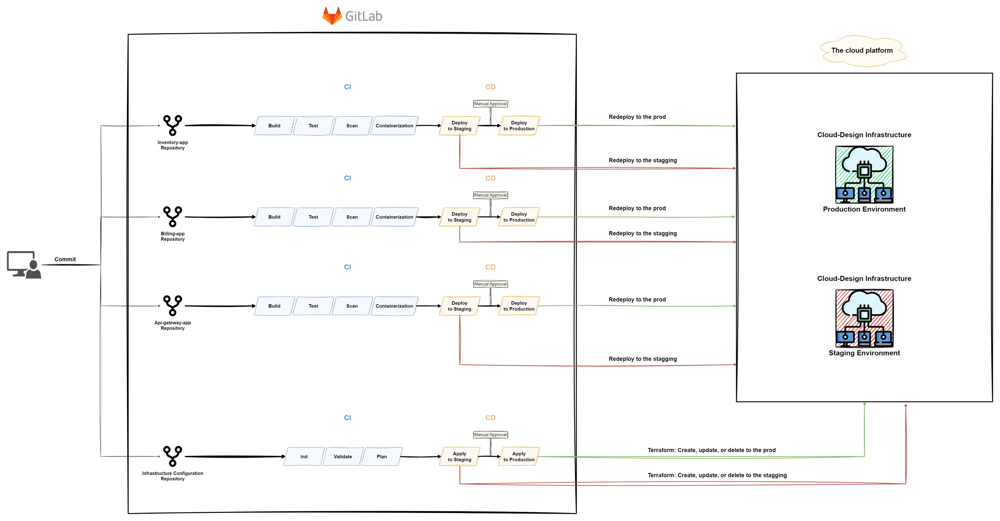

# CODE-KEEPER

This task now combines all the previous tasks and adds GitLab CI/CD pipeline on top of it.

*  Deploying GitLab instance and runner on my own ubuntu server;
*  Manually creating GitLab access token in UI
*  Creating staging and production groups and add repos into those;
*  Spinning up AWS EKS with terraform;
*  Deploying ArgoCD with secrets to that EKS;
*  ArgoCD will add all the manifests to that EKS;

Edit vault `ansible-vault edit vault.yml --vault-password-file example-pw-vault`

Run each playbook with `ansible-playbook -i inventory --vault-password-file example-vault-pw playbooks/misc/20-rm-git-dir.yaml`

### 1.

Starting with GitLab [instance playbook](ansible/playbooks/00-gitlab.yaml) and [runner playbook](ansible/playbooks/01-gitlab-runner.yaml).

Wait for the instance to start and then pull [Initial password playbook](ansible/playbooks/02-pw.yaml). Logging into the UI, creating new access token and add token to ansible vault.

[New runner playbook](ansible/playbooks/03-new-runner.yaml) for CI/CD worker.

Add [ssh key playbook](ansible/playbooks/04-add-ssh.yaml) to be able to pull and push repos.

### 2.

Create new group with [new group playbook](ansible/playbooks/git-repos/00-create-group.yaml) for repos to use variables across projects. 
Add [variables playbook](ansible/playbooks/git-repos/01-add-vars.yaml).

Init repost with [init repo playbook](ansible/playbooks/git-repos/02-init-repos.yaml)

### 3 

CI/CD pipelines are starting when repos are added. 

Now from GitLab UI manually merging manifest and prod-manifest repos to main branch for ArgoCD to be able to git pull those manifests.

### 4

Deploying AWS EKS manually from GitLab by running the deploy job. This takes usually ~ 15-20 minutes.

### 5

Adding AWS credentials to AWS CLI

 and then deploying ArgoCD by using [cluster script](argo/cluster.sh) and running `sh cluster.sh deploy-1` for staging and `sh cluster.sh deploy-2` for production.

`sss-mypublickey.pem` is needed for using these sealed secrets which is not in repo to run this project.

### 6

Taking pw from terminal and running `sh cluster.sh argo` to access ArgoCD UI.

Services are coming up after first ArgoCD refresh which is after ~3 minutes usually.
Hitting that refresh will launch them immediately.

### Destroy

Take down both clusters in GitLab by running destroy job on both pipelines.

